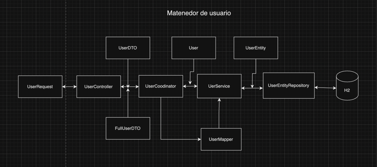
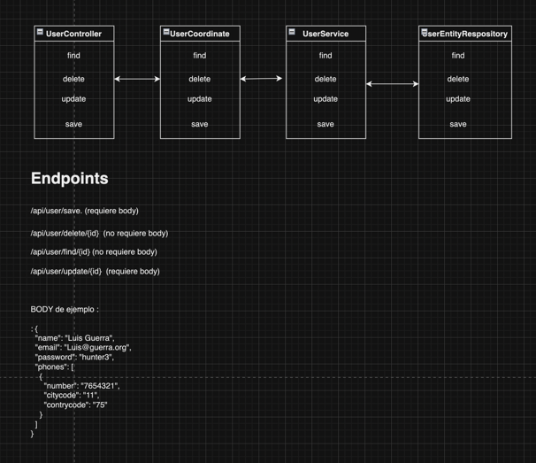
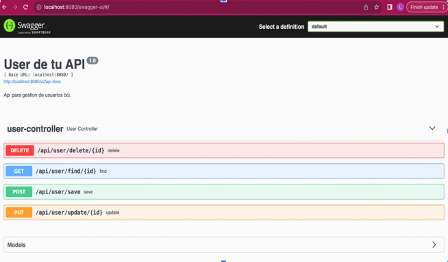

# Mantenedor de Usuarios

## Información General
Este es un proyecto de mantencion de usuarios de BCI.

## Requisitos
- Java JDK: Versión 17.0.10-jbr
- Gradle: 7.4-bin

## Configuración del Proyecto
1. **Clonar el Repositorio:**
    ```bash
    git clone https://github.com/luchoguerraa/user.git
    cd maintainer
    ```

2. **Ejecutar la Aplicación:**
    ```bash
    ./gradlew bootRun
    ```

3. **Ejecutar Pruebas Unitarias:**
    ```bash
    ./gradlew test
    ```

## Configuración de Lombok en IntelliJ IDEA
1. Instala el plugin de Lombok en IntelliJ IDEA.
2. Habilita la anotación de procesador de Lombok en la configuración del proyecto:
   

3. Reinicia IntelliJ IDEA.

## Patrones de Contraseña
La expresión regular ^[a-zA-Z0-9]{6,12}$ es un patrón que se utiliza para validar contraseñas. Aquí hay una explicación de los elementos de la expresión regular:

^: Indica que la cadena debe comenzar con el patrón que sigue a continuación.
[a-zA-Z0-9]: Representa un conjunto de caracteres permitidos en la contraseña. En este caso, se permiten letras mayúsculas, letras minúsculas y dígitos del 0 al 9.
{6,12}: Indica que el conjunto de caracteres permitidos debe aparecer entre 6 y 12 veces.
$: Indica que la cadena debe terminar después del patrón.
En resumen, la expresión regular valida contraseñas que cumplen con los siguientes criterios:

Deben consistir en letras mayúsculas, letras minúsculas y/o dígitos.
Deben tener una longitud de al menos 6 caracteres y como máximo 12 caracteres.
Ejemplo de contraseñas que cumplen con esta expresión regular:

### Ejemplo de contraseña que cumplen con la expresión regular :

Abc123
Password9
XYz987

### Ejemplo de contraseñas que no cumplen con esta expresión regular:

Short (demasiado corta)
TooLongPassword (demasiado larga)
Special@Chars (contiene caracteres especiales, que no están permitidos según la expresión regular)

## ID de Usuario

Para el usuario se debe seguir con el formato de UUID.

Un UUID (Universally Unique Identifier) sigue un formato específico que consta de 32 caracteres hexadecimales, divididos en cinco grupos separados por guiones, con la siguiente estructura:
## Email

Para garantizar la validez de las direcciones de correo electrónico de los usuarios, se ha establecido el siguiente patrón:
^[a-zA-Z]+@[a-zA-Z]+\.[a-zA-Z]{2,}$

### Explicación:

^: Marca el inicio de la cadena.
[a-zA-Z]+: Representa uno o más caracteres alfabéticos (mayúsculas o minúsculas) para la parte local del correo electrónico (antes del símbolo '@').
@: El símbolo '@' es obligatorio en todas las direcciones de correo electrónico.
[a-zA-Z]+: Igual que la primera parte, representa uno o más caracteres alfabéticos para el dominio del correo electrónico (después del símbolo '@').
\.: Representa el punto (.) que separa el dominio de nivel superior (TLD) de la dirección de correo electrónico.
[a-zA-Z]{2,}: Indica que el dominio de nivel superior debe tener al menos dos caracteres alfabéticos (por ejemplo, com, org, es, etc.).
$: Marca el final de la cadena.

### Ejemplo de Correos Electrónicos Válidos:


usuario@dominio.com
john.doe@email.co
info@company.org

### Ejemplo de Correos Electrónicos No Válidos:

usuario@dominio (falta el TLD)
correo@.com (falta el dominio)
@dominio.com (falta la parte local)
Este patrón asegura que las direcciones de correo electrónico de los usuarios cumplan con un formato estándar, proporcionando una capa adicional de validación en la entrada de datos.


## Diseño 

### Componentes


### Clases


## Swagger

URL : http://localhost:8080/swagger-ui/



## Ejemplos de CURL

### Consultar usuario
```bash
curl --location 'http://localhost:8080/api/user/find/7d26e2f1-c88b-496e-87ae-f46b3f900ef0' \
--header 'Cookie: JSESSIONID=035ACD4CB5FCFFCAA2E8E29B3E293C5F'

```
### Crear usuario
```bash
curl --location 'http://localhost:8080/api/user/save' \
--header 'Content-Type: application/json' \
--header 'Cookie: JSESSIONID=035ACD4CB5FCFFCAA2E8E29B3E293C5F' \
--data-raw '{
  "name": "Juan Rodriguez",
  "email": "juan@rodriguez.org",
  "password": "hunter2",
  "phones": [
    {
      "number": "1234567",
      "citycode": "1",
      "contrycode": "57"
    }
  ]
}'

```
### Actualizar usuario
```bash
curl --location --request PUT 'http://localhost:8080/api/user/update/7d26e2f1-c88b-496e-87ae-f46b3f900ef0' \
--header 'Content-Type: application/json' \
--header 'Cookie: JSESSIONID=035ACD4CB5FCFFCAA2E8E29B3E293C5F' \
--data-raw '{
  "name": "Luis Guerra",
  "email": "Luis@guerra.org",
  "password": "hunter3",
  "phones": [
    {
      "number": "7654321",
      "citycode": "11",
      "contrycode": "75"
    },
        {
      "number": "999999",
      "citycode": "11",
      "contrycode": "75"
    }

  ]
}'

```

### Borrar usuario
```bash
curl --location --request DELETE 'http://localhost:8080/api/user/delete/6690d876-76c6-445b-acb5-db3398d5c' \
--header 'Content-Type: application/json' \
--header 'Cookie: JSESSIONID=035ACD4CB5FCFFCAA2E8E29B3E293C5F' \
--data ''

```

## Script base de datos 

### configuracion 

spring.datasource.url=jdbc:h2:mem:testdb
spring.datasource.driverClassName=org.h2.Driver
spring.datasource.username=sa
spring.datasource.password=password
spring.jpa.database-platform=org.hibernate.dialect.H2Dialect


Ruta : script /sql_script/script.sql
acceso url : http://localhost:8080/h2-console/

```sql
-- Tu script SQL aquí
CREATE USER IF NOT EXISTS "SA" SALT '4fa77529ef8dbd39' HASH '925c166550e10ce571e7c6cdc94c63c28e483513b36e5199b7a4950d31bee995' ADMIN;
CREATE MEMORY TABLE "PUBLIC"."USER_ENTITY"(
    "ID" BINARY NOT NULL,
    "CREATED" TIMESTAMP,
    "EMAIL" VARCHAR(255),
    "ISACTIVE" BOOLEAN NOT NULL,
    "LAST_LOGIN" TIMESTAMP,
    "MODIFIED" TIMESTAMP,
    "NAME" VARCHAR(255),
    "PASSWORD" VARCHAR(255),
    "TOKEN" VARCHAR(255)
);
ALTER TABLE "PUBLIC"."USER_ENTITY" ADD CONSTRAINT "PUBLIC"."CONSTRAINT_F" PRIMARY KEY("ID");
-- 0 +/- SELECT COUNT(*) FROM PUBLIC.USER_ENTITY;


CREATE USER IF NOT EXISTS "SA" SALT '4fa77529ef8dbd39' HASH '925c166550e10ce571e7c6cdc94c63c28e483513b36e5199b7a4950d31bee995' ADMIN;
CREATE MEMORY TABLE "PUBLIC"."USER_ENTITY_PHONES"(
    "USER_ENTITY_ID" BINARY NOT NULL,
    "CITYCODE" VARCHAR(255),
    "CONTRYCODE" VARCHAR(255),
    "NUMBER" VARCHAR(255)
);
-- 0 +/- SELECT COUNT(*) FROM PUBLIC.USER_ENTITY_PHONES;
ALTER TABLE "PUBLIC"."USER_ENTITY_PHONES" ADD CONSTRAINT "PUBLIC"."FKHNFXNKTR1RLRIPFYWJP15I0V8" FOREIGN KEY("USER_ENTITY_ID") REFERENCES "PUBLIC"."USER_ENTITY"("ID") NOCHECK;
```

